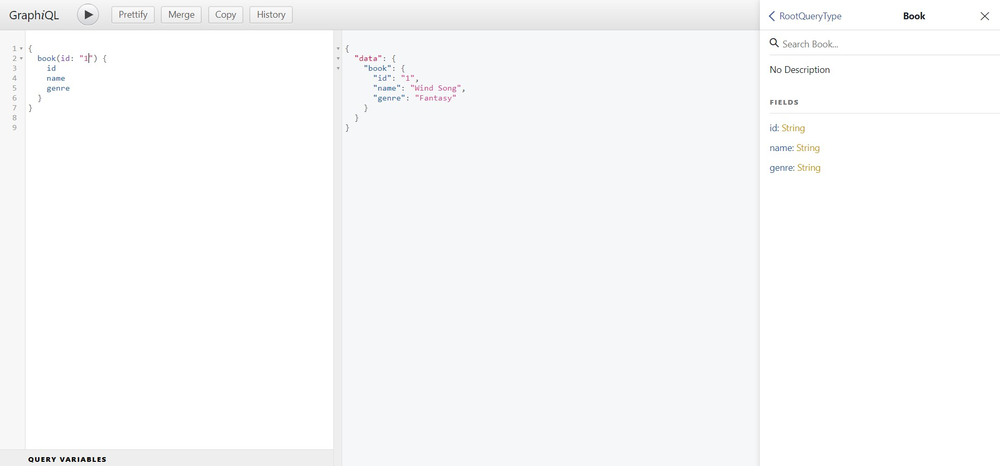

# GraphQL

GraphQL is a query language for APIs which is an alternative for REST APIs. The main advantage of GraphQL is clients can ask for exactly what they need. Therefore, the data that client don't need will not include in the response. [Visit GraphQL to get more information](https://graphql.org/).

To illustrate how GraphQL works, I created web server with express and front-end application with React.

## Technologies


## Install GraphQL

You need to install graphql and express-graphql packages to use graphql in express.

```
npm install graphql express-graphql
```

## Define Schema

You need to define schema to let GraphQL know what kind of data you have.

```js
// schema.js
const graphql = require('graphql');

const { GraphQLObjectType, GraphQLString, GraphQLSchema } = graphql;

// define book type
const BookType = new GraphQLObjectType({
  name: 'Book',
  fields: () => ({
    id: { type: GraphQLString },
    name: { type: GraphQLString },
    genre: { type: GraphQLString },
  }),
});

const RootQuery = new GraphQLObjectType({
  name: 'RootQueryType',
  fields: {
    book: {
      type: BookType,
      args: { id: { type: GraphQLString } },
      resolve(parent, args) {
        // code to get data from database or other source
      },
    },
  },
});

module.exports = new GraphQLSchema({
  query: RootQuery,
});
```

## Set up GraphQL middleware

After defining the schema, you can use that schema to include in graphql. Moreover, GraphQL provides graphical tool for test sending the request.

```js
const express = require('express');
const { graphqlHTTP } = require('express-graphql');
const schema = require('./schema/schema');

const app = express();

// middleware - go to localhost:4000/graphql to enable graphical tool
app.use(
  '/graphql',
  graphqlHTTP({
    schema,
    graphiql: true,
  })
);

app.listen(4000, () => {
  console.log('server is listening on port 4000');
});
```

### GraphQL graphical tool



## Make ID argument more flexible

The above example will use id as a string type. If client provides integer, GraphQL will send cannot find id message because of unmatched type. However, you can make it be more flexible with `GraphQLID`. Therefore, just only change from `GraphQLString` to `GraphQLID` type.

## Add more than one schema

```js
// define author type
const AuthorType = new GraphQLObjectType({
  name: 'Author',
  fields: () => ({
    id: { type: GraphQLID },
    name: { type: GraphQLString },
    star: { type: GraphQLFloat },
  }),
});

const RootQuery = new GraphQLObjectType({
  name: 'RootQueryType',
  fields: {
    book: {
      type: BookType,
      args: { id: { type: GraphQLID } },
      resolve(parent, args) {
        // code to get data from database or other source
        return _.find(books, { id: args.id });
      },
    },
    author: {
      type: AuthorType,
      args: { id: { type: GraphQLID } },
      resolve(parent, args) {
        return _.find(authors, { id: args.id });
      },
    },
  },
});
```

## Type Relations

Add relation between two schemas with `resolve(parent, args)` which enable you to give nested data to client.

```js
// schema data
const books = [
  { id: '1', name: 'Wind Song', genre: 'Fantasy', authorId: '1' },
  { id: '2', name: 'Strong Warrior', genre: 'Adventure', authorId: '2' },
  { id: '3', name: 'The Great Black Hole', genre: 'Sci-Fi', authorId: '3' },
];

const authors = [
  { id: '1', name: 'James Kotlin', star: 4 },
  { id: '2', name: 'Rose Pumpkin', star: 4.5 },
  { id: '3', name: 'Sweet Hunk', star: 5 },
];

// define book type
const BookType = new GraphQLObjectType({
  name: 'Book',
  fields: () => ({
    id: { type: GraphQLID },
    name: { type: GraphQLString },
    genre: { type: GraphQLString },
    author: {
      type: AuthorType,
      resolve(parent, args) {
        return _.find(authors, { id: parent.authorId });
      },
    },
  }),
});
```

```js
// query example
{
  book(id: 1) {
    name
    genre
    author{
      name
      star
    }
  }
}
```

## GraphQL Lists

In case your child data have more than one. For example, one author has more than one book. How we can output all of the author's books? The solution is graphql Lists.

```js
// schema data
const books = [
  { id: '1', name: 'Wind Song', genre: 'Fantasy', authorId: '1' },
  { id: '2', name: 'Strong Warrior', genre: 'Adventure', authorId: '2' },
  { id: '3', name: 'The Great Black Hole', genre: 'Sci-Fi', authorId: '3' },
  { id: '4', name: 'Minor Major', genre: 'Sci-Fi', authorId: '1' },
  { id: '5', name: 'Time Slot', genre: 'Sci-Fi', authorId: '2' },
  { id: '6', name: 'Divine Sword', genre: 'Adventure', authorId: '3' },
];

// define author type
const AuthorType = new GraphQLObjectType({
  name: 'Author',
  fields: () => ({
    id: { type: GraphQLID },
    name: { type: GraphQLString },
    star: { type: GraphQLFloat },
    books: {
      type: new GraphQLList(BookType),
      resolve(parent, args) {
        return _.filter(books, { authorId: parent.id });
      },
    },
  }),
});
```

```js
// query example
{
  author(id: 1) {
    name
    star
    books{
      name
      genre
    }
  }
}
```

## Root Queries

Maybe you would like to send all data like all books or all authors. You can do that in root queries.

```js
const RootQuery = new GraphQLObjectType({
  name: 'RootQueryType',
  fields: {
    book: {
      type: BookType,
      args: { id: { type: GraphQLID } },
      resolve(parent, args) {
        // code to get data from database or other source
        return _.find(books, { id: args.id });
      },
    },
    author: {
      type: AuthorType,
      args: { id: { type: GraphQLID } },
      resolve(parent, args) {
        return _.find(authors, { id: args.id });
      },
    },
    // add books
    books: {
      type: new GraphQLList(BookType),
      resolve(parent, args) {
        return books;
      },
    },
    // add authors
    authors: {
      type: new GraphQLList(AuthorType),
      resolve(parent, args) {
        return authors;
      },
    },
  },
});
```

## Connect to Database

In this tutorial, I will use MongoDB Atlas as a MongoDB Hosting.

```js
// app.js
const express = require('express');
const { graphqlHTTP } = require('express-graphql');
const schema = require('./schema/schema');
const mongoose = require('mongoose');
require('dotenv').config({ path: './.env' });

const app = express();

mongoose.connect(
  `mongodb+srv://${process.env.MONGODB_USERNAME}:${process.env.MONGODB_PASSWORD}@${process.env.MONGODB_CLUSTER}.1f312.mongodb.net/myFirstDatabase?retryWrites=true&w=majority`
);
mongoose.connection.once('open', () => {
  console.log('connected to database');
});

// middleware - go to /graphql to enable graphical tool
app.use(
  '/graphql',
  graphqlHTTP({
    schema,
    graphiql: true,
  })
);

app.listen(4000, () => {
  console.log('server is listening on port 4000');
});
```

## Create model

In order to make MongoDB understand your data schema, you need to define schema with mongoose. Then, import model in app.js.

```js
const mongoose = require('mongoose');
const Schema = mongoose.Schema;

const bookSchema = new Schema({
  name: String,
  genre: String,
  authorId: String,
});

// create collection in MongoDB with this schema
module.exports = mongoose.model('Book', bookSchema);
```

## Mutation

Mutation is making change with data like add, edit, remove data.

```js
const Book = require('../models/book');
const Author = require('../models/author')
...
const Mutation = new GraphQLObjectType({
  name: 'Mutation',
  fields: {
    addAuthor: {
      type: AuthorType,
      args: {
        name: { type: GraphQLString },
        star: { type: GraphQLFloat },
      },
      resolve(parent, args) {
        // create an instance to add author to database
        let author = new Author({
          name: args.name,
          star: args.star,
        });
        return author.save();
      },
    },
    addBook: {
      type: BookType,
      args: {
        name: { type: GraphQLString },
        genre: { type: GraphQLString },
        authorId: { type: GraphQLID },
      },
      resolve(parent, args) {
        // create an instance to add author to database
        let book = new Book({
          name: args.name,
          genre: args.genre,
          authorId: args.authorId,
        });
        return book.save();
      },
    },
  },
});


module.exports = new GraphQLSchema({
  query: RootQuery,
  mutation: Mutation
});
```

```js
// query addAuthor
mutation {
  addAuthor(name: "James Kotlin", star: 4) {
    name
    star
  }
}

// query addBook
mutation {
  addBook(name: "Wind Song", genre: "Fantasy" authorId: "61553ce8ff3c9ab58a9fb86e") {
    name
    genre
  }
}
```

## Find data from database

```js
// app.js
const Author = require('../models/author');
const Book = require('../models/book');
...
// define book type
const BookType = new GraphQLObjectType({
  name: 'Book',
  fields: () => ({
    id: { type: GraphQLID },
    name: { type: GraphQLString },
    genre: { type: GraphQLString },
    author: {
      type: AuthorType,
      resolve(parent, args) {
        // use model to find data by id argument
        return Author.findById(parent.authorId);
      },
    },
  }),
});
...
const RootQuery = new GraphQLObjectType({
  name: 'RootQueryType',
  fields: {
    book: {
      type: BookType,
      args: { id: { type: GraphQLID } },
      resolve(parent, args) {
        // code to get data from database or other source
        return Book.findById(args.id);
      },
    },
    author: {
      type: AuthorType,
      args: { id: { type: GraphQLID } },
      resolve(parent, args) {
        return Author.findById(args.id);
      },
    },
    books: {
      type: new GraphQLList(BookType),
      resolve(parent, args) {
        // return all books because it all matched
        return Book.find({});
      },
    },
    authors: {
      type: new GraphQLList(AuthorType),
      resolve(parent, args) {
        return Author.find({});
      },
    },
  },
});
...
```

## Not allow null value

Some data in the schema should not be null when adding data. Therefore, you can use `GraphQLNonNull` to prevent this situation.

```js
const { GraphQLNonNull } = graphql;
...
const Mutation = new GraphQLObjectType({
  name: 'Mutation',
  fields: {
    addAuthor: {
      type: AuthorType,
      args: {
        name: { type: new GraphQLNonNull(GraphQLString) },
        star: { type: new GraphQLNonNull(GraphQLFloat) },
      },
      resolve(parent, args) {
        // create an instance to add author to database
        let author = new Author({
          name: args.name,
          star: args.star,
        });
        return author.save();
      },
    },
    addBook: {
      type: BookType,
      args: {
        name: { type: new GraphQLNonNull(GraphQLString) },
        genre: { type: new GraphQLNonNull(GraphQLString) },
        authorId: { type: new GraphQLNonNull(GraphQLID) },
      },
      resolve(parent, args) {
        // create an instance to add author to database
        let book = new Book({
          name: args.name,
          genre: args.genre,
          authorId: args.authorId,
        });
        return book.save();
      },
    },
  },
});
```

## Apollo

Front-end application like React do not understand how to query with GraphQL. Thus, Apollo come to handle GraphQL queries as a GraphQL Client.

### Installation for react

```
npm install apollo-boost react-apollo graphql --save
```

### Set up in app.js

```js
import React from 'react';
import ApolloClient from 'apollo-boost';
import { ApolloProvider } from 'react-apollo';
import BookList from './components/BookList';

const client = new ApolloClient({
  uri: 'http://localhost:4000/graphql',
});

function App() {
  return (
    <ApolloProvider client={client}>
      <h1>Book Shop</h1>
      <BookList />
    </ApolloProvider>
  );
}

export default App;
```

### GraphQL Query

```js
// BookList.js
import React, { useState, useEffect } from 'react';
import { gql } from 'apollo-boost';
import { graphql } from 'react-apollo';
import classes from './BookList.module.css';

const getBooksQuery = gql`
  {
    books {
      id
      name
      genre
    }
  }
`;

const BookList = (props) => {
  const [books, setBooks] = useState([]);
  const isLoading = props.data.loading;

  useEffect(() => {
    displayBooks();
  }, [isLoading]);

  const displayBooks = () => {
    setBooks(props.data.books);
  };

  if (books === undefined) {
    return <div>Loading...</div>;
  }

  return (
    <section className={classes.books_container}>
      <ul id="book-list">
        {books.map((book) => {
          return <li key={book.id}>{`${book.name} (${book.genre}`})</li>;
        })}
      </ul>
    </section>
  );
};

export default graphql(getBooksQuery)(BookList);
```
